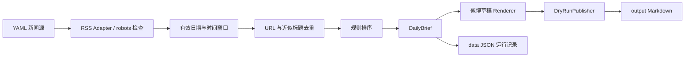

# SAP・AI 科技早报

由 Python 驱动、适合 GitHub 托管的可追溯早报管道。当前实现 Phase 1：读取公开 RSS/Atom、标准化、去重、规则排序、生成本地草稿和运行记录。**不会向微博发送任何内容，也不需要账号或 Secret。**

## 架构



## 安装与本地运行

需要 Python 3.12+，从仓库根目录运行。推荐 uv：

```bash
uv sync --frozen --extra dev --no-editable
uv run --no-editable python -m sap_ai_daily run --dry-run
```

也可使用 pip：

```bash
python3.12 -m venv .venv
source .venv/bin/activate
python -m pip install '.[dev]'
python -m sap_ai_daily run --dry-run
```

成功后生成 `output/YYYY-MM-DD.md` 与 `data/YYYY-MM-DD.json`。此外保存 `data/YYYY-MM-DD-RUN_ID.json`，保留每次尝试的来源、数量、跳过条数、URL、草稿、hash、错误类型和耗时。真实 RSS 读取需要互联网；测试完全使用 HTTP mock。

```bash
uv run --no-editable python -m sap_ai_daily run
uv run --no-editable python -m sap_ai_daily run --date 2026-09-12 --dry-run
uv run --no-editable python -m sap_ai_daily run --config-dir config --dry-run
```

无参数 publisher 始终是 Dry Run，`--dry-run` 用于明确表达意图。重复 Dry Run 可更新当天草稿，每次运行记录独立保留；如果发现该日期已有 `published` 成功记录，默认拒绝生成，`--force` 可重新生成本地草稿，仍不能真实发布。日期与正文 hash 都在记录中保存。

业务时区固定为 Asia/Shanghai。当天按执行时刻截止；历史日期按该日结束时刻截止，默认回溯 48 小时。缺失发布日期、未来及过期新闻不会进入草稿。指定历史日期只筛选当前 feed，不能恢复已从 feed 移除的历史新闻。日期不能晚于当前上海日期。

## Dry Run 与内容质量

Phase 1 不调用 LLM，因此**英文源保留英文标题和简短来源摘录**，不会声称已经生成经过事实核验的中文成稿。所有条目 `verified=false`、`confidence_score=0`；来源官方身份不等于独立事实核验。稿件明确标注待人工编辑。

排序综合配置的来源优先级、新鲜度、AI/SAP 分类、企业关键词和推广/传闻词惩罚，最多 8 条，不凑数量。URL 去除追踪参数但保留业务参数，近似标题比较保护不同数字/版本，并保留合并来源链接。排除 GeForce NOW 等明确消费游戏资讯。这是基础启发式，无法可靠识别跨语言或大幅改写的同一事件。

长度以 Python 字符数计，**不是微博平台字数口径**。先降低摘要句子预算，再移除完整条目并提示查看记录，不截断整段文案。单条完整标题仍放不下时终止。结构化记录保留完整入选条目与来源。

## 配置新闻源

编辑 `config/sources.yaml`，每项提供 `id`、`name`、`category`（ai/sap/enterprise）、`type: rss`、`url`、`priority: 0..100`、`enabled`，可用 `core` 标记核心源。

默认使用 [SAP News Center RSS](https://news.sap.com/feed/)、[NVIDIA Blog RSS](https://blogs.nvidia.com/feed/)、[AWS What's New RSS](https://aws.amazon.com/about-aws/whats-new/recent/feed/)。这些是官方域名的公开 feed，内容和可用性可能变化。新增来源前核对官方公开订阅方式与使用条款；没有稳定 RSS/API 的来源暂不接入，不用脆弱 HTML selector。

每次源请求先检查 robots.txt；404/410 视为无规则，明确禁止或其他访问异常时关闭该源。每源每次抓取一次，20 秒超时，最大 5 MB，不绕过访问限制；请勿高频循环运行。单源失败继续；全部核心源失败或没有合格新闻时记录失败并返回非零退出码，不生成虚假早报。先前已生成文件不会被失败运行删除，应检查本次运行状态。

`config/settings.yaml` 控制最大条数、窗口、长度、是否附链接和输出路径。相对输出路径基于当前工作目录。

## LLM 配置

`.env.example` 预留 `LLM_PROVIDER`、`LLM_API_KEY`、`LLM_MODEL`。Phase 1 不读取或调用 LLM，这些值目前不生效。Phase 2 再实现基于来源的中文摘要、结构化校验和有限重试，不能用模型补造事实。

## 微博发布与 Secret 管理

`WeiboPublisher` 仅是失败关闭的接口占位，任何调用都会报错，即使提供所有凭据或 `PUBLISH_ENABLED=true` 也不会发布。CLI 不接受 production publisher。尚未验证微博当前账号权限、OAuth 生命周期、图片接口和配额，Phase 4 才核对官方文档并实现。

实际 `.env` 被忽略；本阶段不自动加载 `.env`。未来凭据只通过环境变量/GitHub Actions Secrets 注入，不写入仓库、不打印日志。不要把 Token、Cookie 或密码贴在 Issue 或聊天中。

## 测试

```bash
uv run --no-editable ruff check .
uv run --no-editable ruff format --check .
uv run --no-editable pytest
```

覆盖标准化、去重、排序、长度、配置、RSS/robots、时间区间、失败处理、历史记录及禁止真实发布。测试不访问外部网站或微博。

## GitHub Actions

`test.yml` 在 push / pull_request 执行 lint、格式检查、pytest，使用 `uv.lock` 固定依赖。先通过 Phase 1 本地验收，再启用每日生成工作流；GitHub 仓库备份使用私有可见性；不配置每日运行或真实微博发布。

## 当前限制与 Roadmap

- Phase 1：基础管道、本地 Dry Run、审计记录、测试 CI。
- Phase 2：中文改写、重要度判断、编辑点评、结构化 LLM 响应和事实核验。
- Phase 3：每日 GitHub Actions、artifact、缓存/历史持久化与失败告警；目标上海 00:00，工作流需显式处理时区，Actions 排程可能延迟。
- Phase 4：核实微博官方发布权限后再实现 OAuth、图片、production 门禁、跨运行的幂等锁和成功记录持久化。
- Phase 5：更强事件去重、来源评分、固定模板 PNG 封面。

目前没有封面、LLM、真实发布、跨进程执行锁和新闻全文抓取。请勿并发运行同一输出目录。没有真实新闻时命令会失败，这是准确性约束，不能用测试新闻冒充当天结果。

## 本地验收记录（2026-09-12）

Python 3.12 环境通过 lint、格式检查与 mock 测试，并成功从 NVIDIA/AWS 官方 RSS 生成当日草稿。SAP 源本次访问出现拒绝/无效响应，已隔离并记录，不绕过限制。该结果仅表示采集管道可用，不表示新闻已逐条核验。

此 Mac 的可编辑安装 `.pth` 会被标记为 hidden，Python 3.12 因而忽略它；上述命令使用普通安装避开该环境问题。修改代码后请重新执行 `uv sync --extra dev --no-editable --reinstall-package sap-ai-daily` 再验证。

## 项目暂停与恢复

按用户决定，项目于 2026-09-12 暂停：等待开通 [微博 CLI 对应服务](https://open.weibo.com/cli/plan) 后再继续。当前仅备份已完成的 Phase 1，不启用定时采集或微博发布。恢复时先核对服务权限、官方接口、费用和认证方式，再决定后续实施范围。

`examples/2026-09-12/` 保存最近一次真实 Dry Run 的草稿和结构化记录，作为本轮验收快照；未进行逐条事实核验，不应直接发布。日常 `data/`、`output/` 仍保持 Git 忽略，避免持续累积运行数据。
